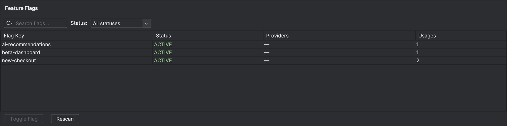
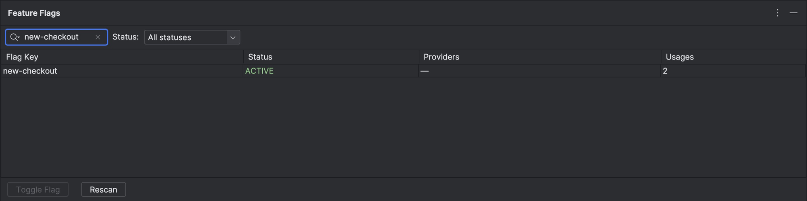
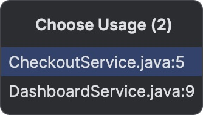
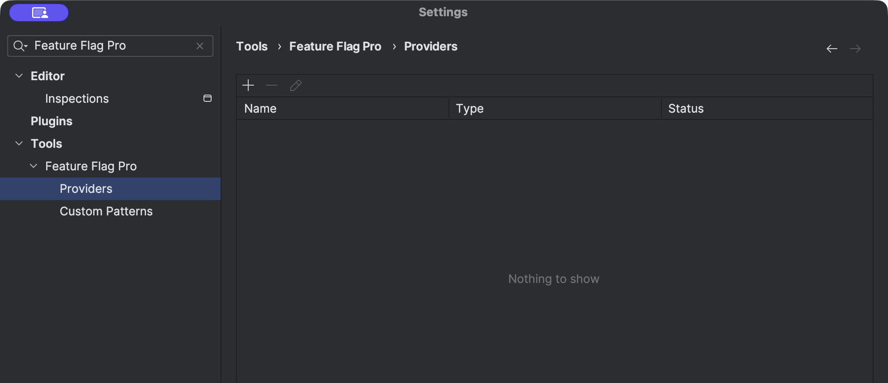
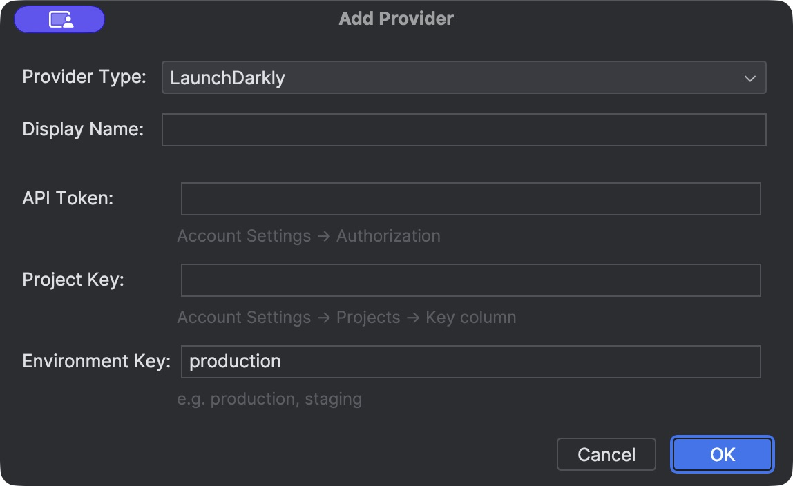
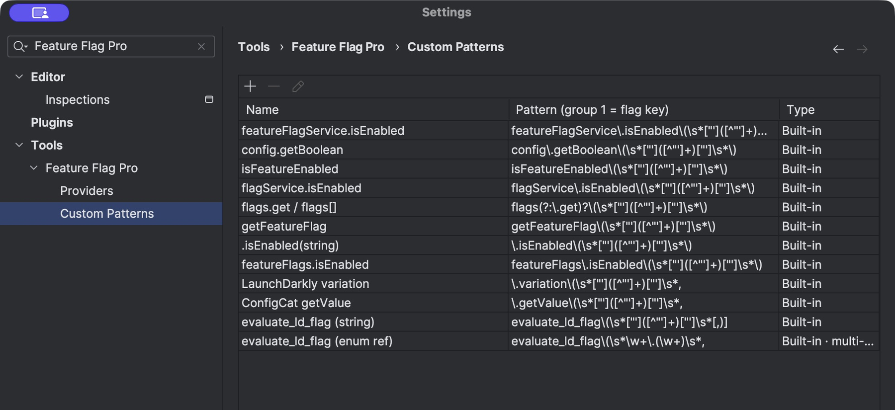
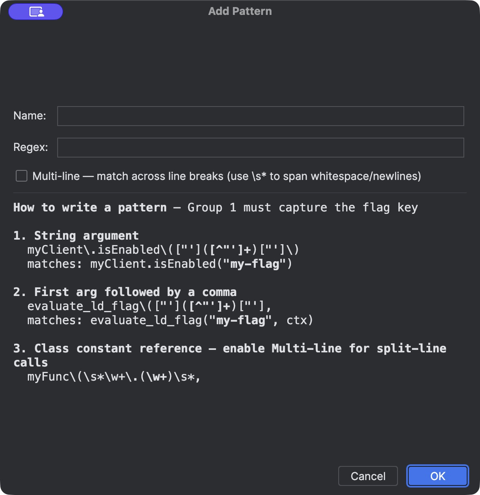

# FeatureFlagPro user guide

FeatureFlagPro finds feature flag calls in your project. It shows each detected flag in the **Feature Flags** tool window. You can find a flag in code, see its provider state, and change a supported boolean flag in a connected provider.

Use this guide after you install FeatureFlagPro from JetBrains Marketplace. The screenshots show a sample project. No provider account is connected in the screenshots.

## Install and activate the plugin

1. Open a compatible JetBrains IDE. FeatureFlagPro requires IntelliJ Platform 2023.3 or later.
2. Open **Settings > Plugins > Marketplace**. On macOS, you can open **Preferences > Plugins > Marketplace**.
3. Search for **FeatureFlagPro**.
4. Select **Install**. Restart the IDE if it asks you to do so.
5. Follow the IDE prompts to activate your Marketplace subscription or trial.
6. Open a project that contains feature flag calls.

You can also open the [FeatureFlagPro Marketplace page](https://plugins.jetbrains.com/plugin/31614-featureflagpro) in a browser.

## 1. Find flags in your project

1. Open your project in the IDE.
2. Select **Feature Flags** on the tool window bar at the bottom of the IDE.
3. Wait for the project scan to finish. The table then shows the detected flags.

The plugin scans the project when you open it. It also scans a file after you save it. Select **Rescan** to scan the project again.

The table has these columns:

| Column | Meaning |
| --- | --- |
| **Flag Key** | The key found in source code. |
| **Status** | **ACTIVE** when the scan finds a use. **DEAD_CANDIDATE** can appear after the last detected use is removed from a saved file. Review the code before you remove a flag. |
| **Providers** | The boolean state from each connected provider. **ON** means true. **OFF** means false. **?** means the plugin cannot determine the state. A dash means no provider state is available. |
| **Usages** | The number of detected locations in the project. |

The table shows flags found in code. It is not a list of all flags in a provider account. Provider values show a remote boolean state. They do not show the result of a user-specific targeting rule.

## 2. Search for a flag and open its code

1. Enter all or part of a flag key in the search field.
2. Select a status in **Status** if you want to limit the results.
3. Double-click a flag row.
4. If a list of locations opens, select the location that you need.

The IDE opens the file at the detected call. In the example, `new-checkout` has two detected locations.

## 3. Connect a provider

FeatureFlagPro supports **LaunchDarkly**, **ConfigCat**, and **Cloudflare Workers KV** in the provider setup window. Get the required credentials and identifiers from your provider account before you start.

1. Open **Settings** (or **Preferences** on macOS).
2. Select **Tools > Feature Flag Pro > Providers**.
3. Select **Add** (+).
4. Select a **Provider Type**.
5. Enter a **Display Name** and the required values for that provider.
6. Select **OK** in the provider window.
7. Select **Apply** or **OK** in Settings.

The fields depend on the provider:

| Provider | Required values |
| --- | --- |
| LaunchDarkly | API token, project key, environment key. |
| ConfigCat | Management API Basic Auth username and password, config ID, environment ID. |
| Cloudflare Workers KV | API token, account ID, KV namespace ID. |

The next image shows the LaunchDarkly fields. Enter the key for the environment that you intend to inspect or change. The plugin stores sensitive credentials in the IDE Password Safe.

After you save a provider, wait for its first sync. The plugin checks connected providers again at regular intervals. If a flag has no provider state, check the provider details and the flag key.

## 4. Change a boolean flag in a provider

**CAUTION:** A change in a connected environment can affect its users. Confirm the provider and environment before you continue.

1. Select a flag in the **Feature Flags** table.
2. Select **Toggle in _provider name_**.
3. Read the confirmation message.
4. Select **Continue** to change the flag. Select **Cancel** to keep its current state.

The plugin reads the current provider value before it changes the flag. It changes a known boolean value from true to false, or from false to true. If the key is absent, the value is unknown, or the provider rejects the write, the plugin reports an error. If **Toggle Flag** is disabled, configure a provider with write access.

## 5. Add a detection pattern

Use a custom pattern when your code uses a flag call that the built-in patterns do not find. A pattern is a regular expression. **Group 1** of the expression must capture the flag key.

1. Open **Settings > Tools > Feature Flag Pro > Custom Patterns**.
2. Review the built-in patterns.
3. Select **Add** (+).
4. Enter a name in **Name**.
5. Enter an expression in **Regex**. Make group 1 capture the flag key.
6. Select **Multi-line** only if the call can extend across lines.
7. Select **OK** in the pattern window.
8. Select **Apply** or **OK** in Settings.
9. Select **Rescan** in the **Feature Flags** tool window.

For example, the expression `myClient\.isEnabled\(["']([^"']+)["']\)` captures `my-flag` from `myClient.isEnabled("my-flag")`.

## 6. Check a result that looks wrong

- If a flag is missing, select **Rescan**. Then check the call syntax and the detection patterns.
- If a flag key is generated at run time, the scanner can miss it. Add a suitable pattern if the key is present as text in a file.
- If a flag appears in error, check the matched code. Text-based detection can match code that is not a real flag call.
- If the provider value is **?** or blank, check the key, credentials, selected environment, and provider access.
- If a flag is **DEAD_CANDIDATE**, check the project before you remove it. A full rescan clears old scan results and can change the status.

## Support and policies

For help, use the [support form](https://product.moonlaboratories.com/support). Include the IDE version, plugin version, operating system, and steps to reproduce the issue. Remove credentials from screenshots and logs before you send them.

Read the [Support Policy](SUPPORT.md), [Privacy Policy](PRIVACY.md), and [License](LICENSE).
