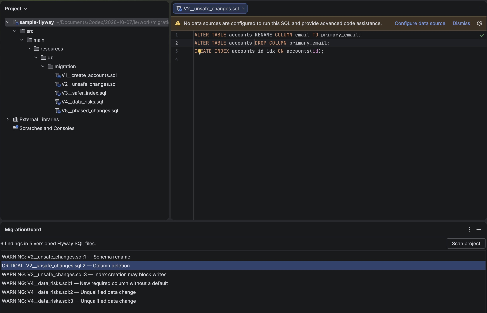

# MigrationGuard User Guide

**Applies to:** technical preview 0.3.0

**Last update:** 2026-10-07

MigrationGuard checks PostgreSQL Flyway migration files in IntelliJ IDEA. It reports SQL changes that can make a deployment unsafe.

This guide describes the technical preview. MigrationGuard is not yet available on JetBrains Marketplace. The screenshots show preview behavior.

## Before you start

- Use IntelliJ IDEA 2025.3.6.1. We tested the preview with this version.
- Use a local project that contains versioned Flyway SQL files.
- Request the preview plugin ZIP from [Moon Laboratories support](SUPPORT.md).

MigrationGuard reads files that match `V<version>__<description>.sql`. It does not scan repeatable migrations such as `R__refresh_view.sql`.

## Install the preview ZIP

1. Open IntelliJ IDEA.
2. Open **Settings** or **Preferences**.
3. Select **Plugins**.
4. Select the gear icon on the Plugins page.
5. Select **Install Plugin from Disk**.
6. Select the MigrationGuard ZIP file.
7. Select **OK**.
8. Restart IntelliJ IDEA if it asks you to restart.

For more information, see [Install plugin from disk](https://www.jetbrains.com/help/idea/managing-plugins.html#install_plugin_from_disk) in the IntelliJ IDEA guide.

## Scan a project

1. Open a project that contains versioned Flyway SQL files.
2. Select **View > Tool Windows > MigrationGuard**.
3. Select **Scan project**.
4. Wait for the scan to finish.
5. Read the finding count above the list.

The sample project in Figure 1 has five migration files and six findings. Your count can be different.

*Figure 1. The preview shows findings by severity, file, line, and title.*

## Read a finding

1. Select a finding in the list.
2. Read **Why risky** in the lower pane.
3. Read **Safer pattern** in the lower pane.
4. Check the SQL and the database conditions.
5. Double-click the finding to open its SQL file.

MigrationGuard opens the file at the reported location. Figure 2 shows the column deletion in `V2__unsafe_changes.sql`.

*Figure 2. Double-click a finding to open its source file.*

The IDE can show a data-source message above the SQL. MigrationGuard does not need a database connection.

## Understand the result

Each finding has a severity, a rule ID, a file, a line, a reason, and a safer pattern.

| Rule | Severity | Condition |
| --- | --- | --- |
| `MG001` | Critical | `DROP TABLE` deletes a table. |
| `MG002` | Critical | `DROP COLUMN` deletes a column. |
| `MG003` | Warning | `RENAME` changes a table or column name. |
| `MG004` | Warning | `CREATE INDEX` does not use `CONCURRENTLY`. |
| `MG005` | Critical | Two files in one migration directory use the same numeric Flyway version. |
| `MG006` | Warning | A new `NOT NULL` column has no default. |
| `MG007` | Warning | `UPDATE` or `DELETE` has no `WHERE` clause. |

**Critical** and **Warning** identify risk types. They do not show that a deployment will fail.

## Scan again after a change

1. Review the finding and its SQL file.
2. Change the migration only after you check its deployment history.
3. Save the file.
4. Select **Scan project** again.
5. Check the new findings.

Do not rename or edit a migration that is already applied without a release plan. MigrationGuard does not change SQL files.

## Free and Pro features

All seven checks run in the 0.3.0 technical preview. This preview does not sell subscriptions or activate Pro licenses.

The planned paid release keeps `MG001`, `MG002`, and `MG005` free. Pro adds `MG003`, `MG004`, `MG006`, and `MG007`.

After the paid release, JetBrains Marketplace will manage trials and subscriptions. We will update this guide with tested activation steps before release.

## If a scan has no findings

1. Check that the project contains files with names such as `V2__add_accounts.sql`.
2. Check that the files are inside the open project.
3. Select **Scan project** again.

A result with no findings does not prove that a migration is safe. MigrationGuard uses static checks for selected SQL patterns.

## Data and support

MigrationGuard checks SQL files on your computer. It does not connect to your database or upload your SQL.

For help, use the [support policy](SUPPORT.md). Read the [privacy policy](PRIVACY.md) and [license](LICENSE) before use.
