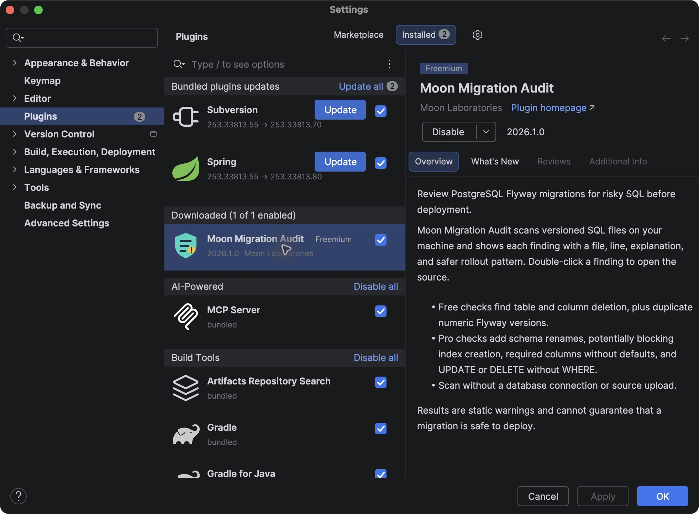
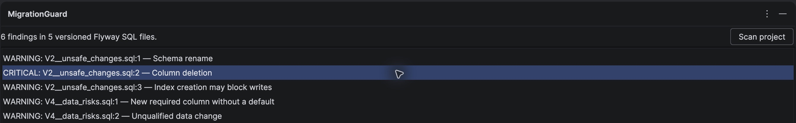

# Flyway Migration Guard User Guide

**For:** People who install Flyway Migration Guard in IntelliJ IDEA, including people with a Pro subscription.

**Updated:** 2026-10-09

Flyway Migration Guard checks PostgreSQL Flyway SQL migrations in your open project. It reports changes that need review before deployment. The Free checks work without a license. A valid trial or Pro subscription adds six checks.

**Availability:** JetBrains is reviewing the Marketplace listing. You can follow the installation steps after JetBrains publishes it.

## Install the plugin

1. Open IntelliJ IDEA 2025.3 or a later compatible version.
2. Open **Settings** on Windows or Linux. Open **Preferences** on macOS.
3. Select **Plugins > Marketplace**.
4. Search for **Flyway Migration Guard** by **Moon Laboratories**.
5. Select **Install**.
6. Restart IntelliJ IDEA if it asks you to restart.

To confirm the installation, select **Plugins > Installed**. Make sure that **Flyway Migration Guard** is enabled.

The screenshots below show an earlier version under the former name, **Moon Migration Audit**. The controls work the same way in Flyway Migration Guard.

*Figure 1. The earlier plugin version is installed and enabled.*

For help with installation, see the [IntelliJ IDEA plugin guide](https://www.jetbrains.com/help/idea/managing-plugins.html).

## Scan your migrations

1. Open your project in IntelliJ IDEA.
2. Select **View > Tool Windows > Flyway Migration Guard**.
3. Select **Scan project**.
4. Wait for the scan to finish.
5. Read the finding count and the findings in the list.

The plugin scans versioned Flyway SQL files that use the default `V` prefix, `__` separator, and `.sql` suffix. For example, it scans `V2__add_accounts.sql`. It does not scan repeatable files such as `R__refresh_view.sql`. If your project changes these filename parts, the plugin does not find those files.

*Figure 2. The Free scan reports a column deletion in an example project. Your results depend on your SQL files.*

## Review a finding

1. Select a finding in the list.
2. Read **Why risky** and **Safer pattern** below the list.
3. Review the SQL and your deployment plan.
4. Double-click the finding to open the SQL file at the reported line.

The plugin does not change your SQL files. It does not need a database connection. If the SQL editor asks you to configure a data source, you can still run the scan.

## Activate a trial or a purchased subscription

1. Select **Unlock Pro** in the Flyway Migration Guard tool window.
2. In the JetBrains license window, sign in with your JetBrains Account.
3. If you bought Pro, use the account that you used for the purchase. Select the Flyway Migration Guard license.
4. If you want a trial, start it when JetBrains offers it in the license window.
5. Return to the tool window and select **Scan project** again.

When sales are available, you can buy Pro on the [Flyway Migration Guard Marketplace page](https://plugins.jetbrains.com/plugin/34848-moon-migration-audit). JetBrains manages the purchase and subscription.

If Pro does not activate, open **Help > Register** in IntelliJ IDEA. Sign in with the account that has the license. Refresh the license list, activate Flyway Migration Guard, and scan again. See the [JetBrains license guide](https://www.jetbrains.com/help/idea/register.html) for more help.

If your trial or subscription ends, you can continue to use the Free checks.

## Know which checks you have

| Rule | Access | What it finds |
| --- | --- | --- |
| `MG001` | Free | `DROP TABLE` deletes a table. |
| `MG002` | Free | `DROP COLUMN` deletes a column. |
| `MG005` | Free | Two files in one migration directory use the same numeric Flyway version. |
| `MG003` | Pro | `RENAME` changes a table or column name. |
| `MG004` | Pro | `CREATE INDEX` does not use `CONCURRENTLY`. |
| `MG006` | Pro | A new `NOT NULL` column has no default. |
| `MG007` | Pro | `UPDATE` or `DELETE` has no `WHERE` clause. |
| `MG008` | Pro | A column type change needs review. |
| `MG009` | Pro | An operation that requires no transaction is inside an explicit transaction. |

Each finding gives you a severity, rule ID, file, line, reason, and safer pattern. A **Critical** or **Warning** label identifies a risk. It does not mean that the migration will fail.

## Scan again after a change

1. Review the finding and its SQL file.
2. Check whether the migration already ran in another environment.
3. Change and save the file only if your deployment plan permits it.
4. Select **Scan project** again.

Do not change an applied migration without a release plan.

## If the scan finds nothing

1. Make sure that your versioned Flyway SQL files are in the open project.
2. Check the file names. For example, use `V2__add_accounts.sql`.
3. Select **Scan project** again.

A scan with no findings does not prove that a migration is safe. The plugin checks selected SQL patterns. It does not test your database or deployment.

## Privacy and help

The plugin reads SQL files on your computer. It does not connect to a database or upload your SQL.

For help with a scan, license, or subscription, see [Support](SUPPORT.md). Read the [Privacy Policy](PRIVACY.md) and [License](LICENSE) for more information.

## Product provider

MOON LABORATORIES PTY LTD provides Flyway Migration Guard under the Moon
Laboratories brand. The company is registered in New South Wales, Australia
(ACN 703 101 384; ABN 45 703 101 384).
